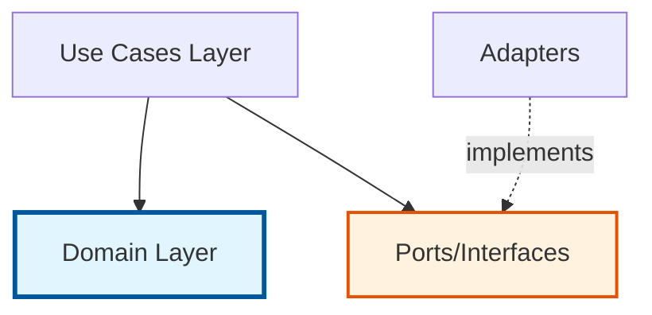
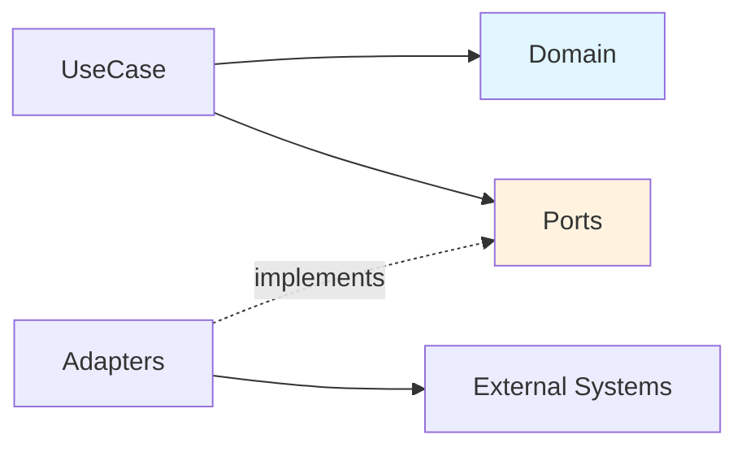

# CLAUDE.md

This file provides guidance to Claude Code (claude.ai/code) when working with code in this repository.

## Project Overview

IES Label Core is a domain-agnostic label management library that provides central label management capabilities for the IES system. It follows Clean Architecture principles with clear separation between domain logic, use cases, and infrastructure ports.

**Key Technologies:**
- Java 21 (LTS)
- Maven 3.8+
- Jakarta Inject for dependency injection
- Jackson for JSON serialization
- Shared Kernel (`ies-shared-kernel`) for common types (Anchor, Identifier)

## Build and Test Commands

### Basic Development Commands
```bash
# Compile the project
mvn clean compile

# Run all tests
mvn test

# Run a single test class
mvn test -Dtest=CreateLabelUseCaseTest

# Run a single test method
mvn test -Dtest=CreateLabelUseCaseTest#testCreateLabelSuccessfully

# Full verification (compile, test, code quality checks)
mvn clean verify
```

### Code Quality Commands
```bash
# Apply code formatting (Google Java Style)
mvn spotless:apply

# Check code formatting
mvn spotless:check

# Run SpotBugs static analysis
mvn spotbugs:check

# Run PMD static analysis
mvn pmd:check

# Generate JaCoCo coverage report (in target/site/jacoco/index.html)
mvn jacoco:report
```

### Dependency Management
```bash
# View dependency tree
mvn dependency:tree

# Analyze dependencies
mvn dependency:analyze

# Check for dependency updates
mvn versions:display-dependency-updates
```

## Architecture

The codebase follows **Hexagonal Architecture (Ports and Adapters)** with Clean Architecture principles:



### Package Structure

- **`domain/`** - Core business logic (framework-independent)
  - `entity/` - Domain entities (Label, Scope)
  - `value/` - Value objects (EntityRef, assignments)
  - `service/` - Domain services (IdentifierResolver)
  - `exception/` - Domain-specific exceptions

- **`usecase/`** - Application use cases (orchestrate domain logic)
  - **Label Management**: `CreateLabelUseCase`, `UpdateLabelUseCase`, `RemoveLabelUseCase`, `RestoreLabelUseCase`
  - **Label Assignment**: `AssignEntitiesToLabelsUseCase`, `UnassignEntitiesFromLabelsUseCase`, `ReassignLabelsToEntitiesUseCase`
  - **Label Queries**: `GetAllLabelsUseCase`, `GetLabelsByIdsUseCase`, `SearchLabelsUseCase`
  - **Assignment Queries**: `GetLabelsAssignByEntitesUseCase`, `GetScopesAssignByLabelsUseCase`
  - All use cases have Request/Result objects (or return primitives/collections)
  - `audit/` - Audit logging support with snapshots and revert handlers

- **`port/`** - Interface definitions for infrastructure (boundaries)
  - `LabelRepository` - Persistence operations (extends `AnchorResolver`)
  - `LabelEntityAssigner` - Entity-to-label assignment operations
  - `LabelScopeAssigner` - Label-to-scope assignment operations
  - `AuthorizationService` - Permission checking
  - `AnchorResolver` - Resolve anchors to IDs (base interface)

### Key Domain Concepts

**Label**: The core entity representing a label with:
- `id` - Unique identifier (optional, assigned by repository)
- `anchor` - Alternative identifier from shared kernel (optional)
- `name` - Display name
- `color` - Visual color representation (6-character hex without `#`, e.g., "ffd700", validated and normalized to lowercase)
- `description` - Detailed description

**Purpose**: Labels are used to:
- Categorize entities for organization
- Mark entities with specific characteristics
- Filter and find entities by their labels
- Read properties from label assignments

**Scope**: UI filtering mechanism (NOT a technical constraint)
- **Critical**: Scopes are **ONLY** for UI filtering - they do NOT restrict which labels can be assigned to entities at the API level
- Labels can be assigned to multiple scopes (e.g., ["user", "global"])
- Labels can have **zero scopes** (useful for automated/internal processes that should not appear in UI)
- The application defines which scopes exist and their semantic meaning
- Use `SearchLabelsUseCase` with scope filter to get labels for UI display
- Technical operations (via API/use cases) can assign ANY label to ANY entity, regardless of scope
- Examples:
  - Scope "user": Shows label in UI when user selects labels for user entities
  - Scope "global": Shows label in UI for multiple entity types
  - No scope: Label is used by automated processes, never shown in UI selection lists

**EntityRef**: Reference to any entity that can be labeled
- `id` - Entity identifier
- `type` - Entity type (allows labeling different entity types)
- Examples: users, roles, privileges, or any domain object

**Anchor**: External identifier system from shared kernel
- Labels can be identified by ID or Anchor
- `AnchorResolver` translates anchors to internal IDs

## Business Rules and Constraints

### Two-Tier Permission Model

The system enforces two distinct permission levels:

**1. Label Manager Permissions** (`AuthorizationService.isLabelManagable()`)
- Required for label lifecycle management (CRUD operations)
- Can create new labels
- Can update existing labels (name, color, description)
- Can delete labels
- Can manage label-to-scope assignments

**2. Entity Write Permissions** (`AuthorizationService.isLabelAssignable()`)
- Required for label assignment/removal
- Can assign labels to entities (if user has write access to those entities)
- Can remove labels from entities (if user has write access to those entities)
- Does NOT allow creating new labels

### Critical Constraints

**No Free-Form Labels**: Users CANNOT create arbitrary or ad-hoc labels. All labels must be pre-created by label managers. This ensures:
- Consistent label naming and categorization
- Controlled vocabulary across the system
- Prevention of label proliferation
- Centralized label management

**Scope-Based UI Filtering**: Scopes are UI filters ONLY - they do NOT restrict label usage at the technical level. Applications use scopes to filter which labels are shown to users in different UI contexts. The application (not this library) defines which scopes exist and their meaning.

**Entity Type Agnostic**: The library doesn't enforce which entity types can be labeled. ANY label can be assigned to ANY entity type at the API level, regardless of scope. Scope filtering is purely a UI concern for improving user experience.

### Dependency Flow



**Use Cases depend on:**
- Domain entities and services
- Port interfaces (injected via constructor)
- Never depend on concrete implementations

**Domain layer:**
- Has NO dependencies on use cases or ports
- Pure business logic
- Framework-independent

**Ports:**
- Define contracts for infrastructure
- Implemented by adapters (not in this module)

**Domain Services:**
- `IdentifierResolver` - Resolves `Identifier` (ID or Anchor) to database IDs using `AnchorResolver` port
- Stateless, created on-demand via factory method: `IdentifierResolver.create(repository)`

### Use Case Pattern

All use cases follow this pattern:
1. Inject dependencies via constructor (ports, `Clock` for timestamps)
2. Accept a Request object as parameter
3. Validate permissions via `AuthorizationService` port
4. Orchestrate domain logic
5. Delegate to ports for infrastructure operations
6. Return Result object (with audit data) or primitive value

**Result Pattern**: Most mutation operations return sealed result types with variants:
- **Assigned/Unassigned** vs **Skipped** - Indicates whether changes were made or operation was no-op
- Results include `LabelSnapshot`, `timestamp`, and effective changes for audit logging
- Example: `AssignEntitiesToLabelsResult.assigned(...)` or `AssignEntitiesToLabelsResult.skipped()`
- `UpdateLabelResult` uses sealed interface with `Updated` and `Unchanged` implementations

**Label CRUD Use Cases** (Create/Update/Remove):
```java
public CreateLabelResult createLabel(CreateLabelRequest request) {
  // 1. Check for Label Manager permission
  if (!this.authorizationService.isLabelManagable()) {
    throw new AccessDeniedException("User is not allowed to create labels.");
  }

  // 2. Delegate to repository
  String labelId = this.repository.create(request.label());

  // 3. Handle scope assignment if needed
  if (!request.scopes().isEmpty()) {
    this.scopeAssigner.assignScopesToLabels(List.of(labelId), request.scopes());
  }

  // 4. Return result with snapshot for audit logging
  return new CreateLabelResult(labelId, snapshot, timestamp);
}
```

**Label Assignment Use Cases** (Assign/Unassign entities):
```java
public AssignEntitiesToLabelsResult assignEntitiesToLabels(
    AssignEntitiesToLabelsRequest request) {

  // 1. Resolve label identifiers (supports both IDs and Anchors)
  List<String> labelIds =
      IdentifierResolver.create(this.repository).resolve(request.labelIdentifiers());

  // 2. Check for Entity Write permission (different from label manager!)
  if (!this.authorizationService.isLabelAssignable(request.entityRefs())) {
    throw new AccessDeniedException("It is not allowed to assign label to entities.");
  }

  // 3. Delegate to assigner
  this.labelEntityAssigner.assignEntitiesToLabels(labelIds, request.entityRefs());

  // 4. Return result with effective assignments
  return AssignEntitiesToLabelsResult.assigned(effectiveAssignments, timestamp);
}
```

**Key Difference**: Label CRUD requires `isLabelManagable()`, while label assignment requires `isLabelAssignable()`. Never mix these permission checks.

## Audit Logging Support

The library includes built-in audit logging capabilities:

- **Snapshots**: All mutation operations (Create/Update/Remove/Assign/Unassign) return results containing `LabelSnapshot` objects with complete state before/after the operation
- **Timestamps**: Results include `Instant` timestamps (via injected `Clock`) for precise audit trails
- **Revert Handlers**: The `usecase/audit/revert/` package contains handlers to reverse operations:
  - `RevertLabelCreateActionHandler` - Removes created labels
  - `RevertLabelUpdateActionHandler` - Restores previous label state
  - `RevertLabelRemoveActionHandler` - Restores deleted labels (via `RestoreLabelUseCase`)
  - `RevertLabelAssignEntitiesActionHandler` / `RevertLabelUnassignEntitiesActionHandler` - Reverses assignments
  - Batch revert handlers for bulk operations

These support integration with external audit logging systems.

## Testing Notes

This codebase uses:
- **JUnit 5 (Jupiter)** for test framework
- **Mockito** for mocking
- **Hamcrest** for assertions
- **EqualsVerifier** for testing equals/hashCode contracts
- **ToStringVerifier** for testing toString implementations

The Maven Surefire plugin is configured with a tree reporter for better test output visualization.

## Shared Kernel Integration

This module depends on `ies-shared-kernel` which provides:
- `Anchor` - External reference system (e.g., `Anchor.ofString("my-anchor")`)
- `Identifier` - Unified identifier that can be either ID or Anchor
- `EntityRef` - Reference to any entity (id + type)
- Security types like `AccessDeniedException`

### Label Identification

Labels can be identified in two ways:
1. **Database ID** (String) - Assigned by repository on creation
2. **Anchor** - External stable identifier from shared kernel

The `IdentifierResolver` domain service resolves `Identifier` objects to database IDs:
```java
// Supports mixed lists of IDs and Anchors
List<String> labelIds = IdentifierResolver.create(repository)
    .resolve(List.of(
        Identifier.ofId("123"),
        Identifier.ofAnchor(Anchor.ofString("vip-label"))
    ));
// Returns: ["123", "456"] (where 456 is the resolved ID for the anchor)
```

The `toIdentifier()` method on Label creates a unified Identifier (prefers ID over Anchor if both exist).

## Important Implementation Patterns

### Immutability
- All domain entities and value objects are **immutable** (marked with `@Immutable`)
- Use builder pattern for object construction (`Label.builder()`)
- Use `toBuilder()` for creating modified copies

### Request/Result Objects
- All use case parameters wrapped in **Request** records (e.g., `CreateLabelRequest`)
- Use case results wrapped in **Result** classes (e.g., `CreateLabelResult`)
- Request records use `@JsonDeserialize` with builder pattern for flexibility
- Result classes include audit data (snapshots, timestamps, effective changes)

### Dependency Injection
- All use cases use **constructor injection** with `@Inject`
- Dependencies are `final` fields
- Never use field injection or setter injection

### Permission Checking
- **ALWAYS** check permissions at the start of use case methods
- Use `AuthorizationService.isLabelManagable()` for label CRUD operations
- Use `AuthorizationService.isLabelAssignable(entityRefs)` for assignment operations
- Throw `AccessDeniedException` with clear message when permission denied

### Identifier Resolution
- Use `IdentifierResolver.create(repository)` to resolve `Identifier` lists to IDs
- Support both database IDs and Anchors throughout the API
- Request objects typically accept `List<Identifier>` for label references

### Effective Change Detection
- Assignment operations calculate **effective changes** (skip no-ops)
- Return `Skipped` result variant when no actual changes needed
- Prevents unnecessary database writes and audit log noise

### Scope Handling
- **CRITICAL**: Scopes are UI filters ONLY - never enforce scope restrictions in use case logic
- The library does NOT validate that labels match entity scopes during assignment
- Use `SearchLabelsUseCase` with scope parameter when building UI label selection lists
- Labels can have zero scopes - this is valid and used for automated/internal processes
- When displaying labels to users:
  ```java
  // Filter labels by scope for UI display
  SearchLabelsRequest request = SearchLabelsRequest.builder()
      .term("")  // empty for all labels
      .scopes(List.of("user"))  // filter by scope
      .build();
  List<Label> userLabels = searchLabelsUseCase.search(request);
  ```
- When assigning labels programmatically (no UI), ignore scopes:
  ```java
  // Technical assignment - scope is irrelevant
  AssignEntitiesToLabelsRequest request = /* ... */;
  assignUseCase.assignEntitiesToLabels(request);
  // This works regardless of label scopes
  ```

## Code Quality Standards

This project enforces strict code quality:
- **Spotless** with Google Java Style formatting
- **SpotBugs** for bug pattern detection (configured in `spotbug-exclude-filter.xml`)
- **PMD** for code quality rules (configured in `pmd-ruleset.xml`)
- **JaCoCo** for code coverage tracking

All checks run during `mvn verify` and must pass before merging code.

## Quick Reference

### Port Interfaces (Implement These)
| Port | Purpose | Key Methods |
|------|---------|-------------|
| `LabelRepository` | Label persistence | `create()`, `update()`, `remove()`, `restore()`, `get()`, `search()`, `getByIds()` |
| `LabelEntityAssigner` | Entity-label assignments | `assignEntitiesToLabels()`, `unassignEntitiesFromLabels()`, `getEntitiesAssignByLabels()`, `getLabelsAssignByEntities()` |
| `LabelScopeAssigner` | Label-scope assignments | `assignScopesToLabels()`, `reassignScopesToLabels()`, `getScopesAssignByLabels()` |
| `AuthorizationService` | Permission checks | `isLabelManagable()`, `isLabelAssignable()`, `isLabelReadable()` |
| `Clock` | Time source | `instant()` (use `Clock.systemDefaultZone()`) |

### Common Mistakes to Avoid
❌ Using old interface names (`AccessControl`, `LabelAssigner`)
❌ Using old method names (`isLabelManager()`, `isAllowedToAssignLablels()`)
❌ Including `#` in color values (use "ffd700" not "#ffd700")
❌ Mixing permission checks (use correct check for each operation type)
❌ Forgetting to handle `Optional<Label>` from repository.get()
❌ Not using `IdentifierResolver` when accepting `Identifier` parameters
❌ Missing audit snapshots in result objects
❌ Creating mutable domain objects (all should be immutable)
❌ **Treating scopes as technical constraints** (they are UI filters only!)
❌ Validating scope-entity compatibility in use cases (don't do this - scopes don't restrict assignment)
❌ Rejecting labels without scopes as invalid (zero scopes is valid)
❌ Assuming labels with scope "user" can't be assigned to non-user entities (they can!)
