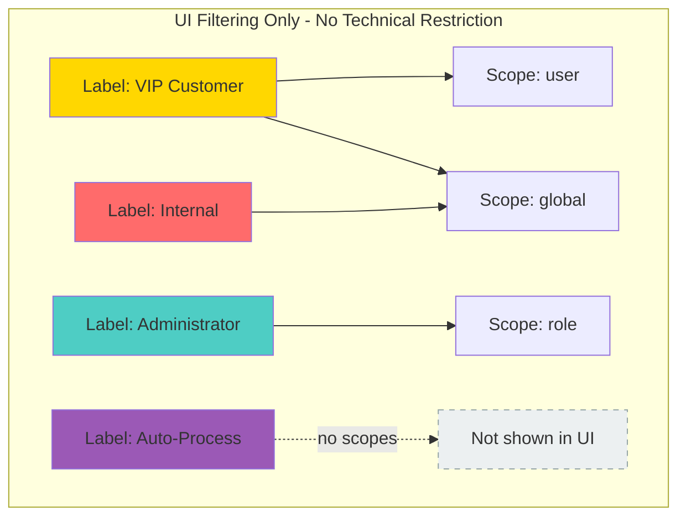
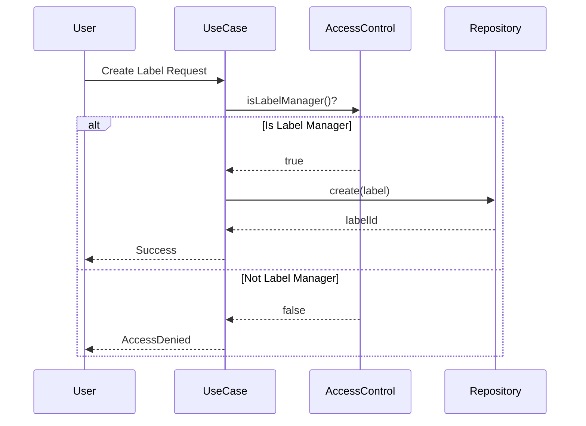
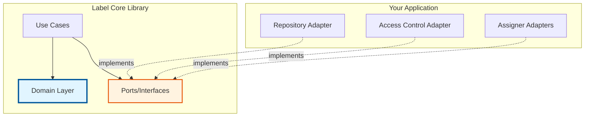

# IES Label Core

A domain-agnostic label management library for the IES system that enables flexible categorization and marking of entities.

## Overview

Label Core provides a centralized system for managing labels that can be attached to various entities (users, roles, privileges, etc.) for categorization, filtering, and property marking purposes. It implements a secure, scope-aware labeling system with fine-grained access control.

## Core Concepts

### Labels

Labels are metadata tags that can be attached to entities to:
- **Categorize** entities for better organization
- **Mark** entities with specific characteristics
- **Filter** and find entities by their labels
- **Read properties** from label assignments

Each label has:
- **Name** - A human-readable identifier
- **Color** - Visual representation for UI display
- **Description** - Optional detailed explanation of the label's purpose
- **ID or Anchor** - Unique identifier (system-assigned, not user-defined)

### Entities

Entities are the targets that can be labeled. Examples include:
- Users
- Roles
- Privileges
- Any other domain objects in your system

Entities are referenced by an `EntityRef` containing:
- **ID** - The entity's unique identifier
- **Type** - The entity type (e.g., "user", "role", "privilege")

### Scopes

Scopes are **UI filtering mechanisms** to help users select appropriate labels:
- **Purpose**: Restrict which labels are shown in the user interface for different contexts
- **Technical enforcement**: Scopes are **NOT enforced** at the technical/API level - all labels can be assigned to any entity regardless of scope
- **UI filtering**: When displaying labels to users, filter by scope to show only relevant labels
- **Multiple scopes**: Labels can be assigned to multiple scopes (e.g., both "user" and "global")
- **No scope**: Labels can have **zero scopes** - useful for automated processes that assign labels programmatically without user interaction
- **Application-defined**: Your application defines which scopes exist and their meaning

**Example Use Cases:**
- Scope "user": Label appears in UI when managing user entities (but can technically be assigned to any entity)
- Scope "role": Label appears in UI when managing role entities
- No scope: Internal system label for automated workflows, not shown in any UI selection list



## Authorizsation

The library implements two permission levels:

### 1. Label Manager Permissions
Required for label lifecycle management:
- ✅ Create new labels
- ✅ Update existing labels (name, color, description)
- ✅ Delete labels
- ✅ Manage label-to-scope assignments

### 2. Entity Write Permissions
Required for label assignment:
- ✅ Assign labels to entities (if user has write access to the entity)
- ✅ Remove labels from entities (if user has write access to the entity)
- ❌ Cannot create arbitrary labels freely

**Important**: Users cannot create ad-hoc labels. All labels must be created by label managers first.



## Architecture

This library follows **Hexagonal Architecture (Ports and Adapters)** principles:



### What You Provide (Adapters)

Implement these ports to integrate with your infrastructure:

- **`LabelRepository`** - Persistence for label data
- **`LabelAssigner`** - Manage entity-to-label assignments
- **`ScopeAssigner`** - Manage label-to-scope assignments
- **`AccessControl`** - Check user permissions
- **`AnchorResolver`** - Resolve external anchor references (optional)

### What You Get (Use Cases)

The library provides these ready-to-use operations:

- **`CreateLabelUseCase`** - Create new labels with scope assignments
- **`UpdateLabelUseCase`** - Update label properties
- **`RemoveLabelUseCase`** - Delete labels and clean up assignments
- **`AssignEntitiesToLablesUseCase`** - Attach labels to entities
- **`UnassignEntitiesToLablesUseCase`** - Remove labels from entities

## Usage Example

### 1. Implement Required Ports

```java
public class MyLabelRepository implements LabelRepository {
    @Override
    public String create(Label label) {
        // Store label in your database
        return generatedId;
    }
    // ... other methods
}

public class MyAuthorizationService implements AuthorizationService {
    @Override
    public boolean isLabelManagable() {
        // Check current user's permissions
        return currentUser.hasRole("LABEL_MANAGER");
    }

    @Override
    public boolean isLabelAssignable(List<EntityRef> entityRefs) {
        // Check if user can write to these entities
        return entityRefs.stream()
            .allMatch(ref -> currentUser.canWrite(ref));
    }

    @Override
    public boolean isLabelReadable() {
        return currentUser.isAuthenticated();
    }
}
```

### 2. Use the Library

```java
// Inject use cases via dependency injection
@Inject
private CreateLabelUseCase createLabelUseCase;

@Inject
private AssignEntitiesToLabelsUseCase assignUseCase;

@Inject
private SearchLabelsUseCase searchLabelsUseCase;

// Create a label with scopes (as label manager) - shown in UI
CreateLabelRequest request = CreateLabelRequest.builder()
    .label(Label.builder()
        .name("VIP Customer")
        .color("ffd700")  // 6-character hex without #
        .description("High-value customers requiring priority support")
        .build())
    .scopes(List.of("user", "global"))  // Shown in UI for user and global contexts
    .build();

CreateLabelResult result = createLabelUseCase.createLabel(request);
String labelId = result.id();

// Create a label WITHOUT scopes for automated processes - NOT shown in UI
CreateLabelRequest internalRequest = CreateLabelRequest.builder()
    .label(Label.builder()
        .name("Auto-Generated-Report-Pending")
        .color("ff6b6b")
        .description("Internal: Report generation in progress")
        .build())
    .scopes(List.of())  // Empty scopes - not shown in any UI
    .build();

CreateLabelResult internalResult = createLabelUseCase.createLabel(internalRequest);

// Get labels for UI display (filtered by scope)
SearchLabelsRequest searchRequest = SearchLabelsRequest.builder()
    .term("")
    .scopes(List.of("user"))  // Only labels with "user" scope
    .build();
List<Label> userLabels = searchLabelsUseCase.search(searchRequest);
// This returns only labels with "user" scope for UI display

// Assign label to entities (works regardless of scope!)
AssignEntitiesToLabelsRequest assignRequest =
    AssignEntitiesToLabelsRequest.builder()
        .labelIdentifiers(List.of(Identifier.ofId(labelId)))
        .entityRefs(List.of(
            new EntityRef("user123", "user"),
            new EntityRef("user456", "user")
        ))
        .build();

AssignEntitiesToLabelsResult assignResult =
    assignUseCase.assignEntitiesToLabels(assignRequest);
```

## Key Features

✨ **Flexible Entity Support** - Label any entity type in your system
🔒 **Secure Access Control** - Role-based permissions for label management and assignment
🎯 **Scope-Aware** - Restrict labels to specific entity types or usage contexts
🎨 **Visual Metadata** - Colors and descriptions for rich UI presentation
🏗️ **Clean Architecture** - Domain-driven design with clear boundaries
🔌 **Adapter-Based** - Easy integration with any persistence layer
🆔 **Anchor Support** - Works with IES shared kernel identifier system

## Dependencies

- **Java 21+** - LTS version required
- **Jakarta Inject** - Dependency injection API
- **IES Shared Kernel** - Common types (Anchor, Identifier)
- **Jackson** - JSON serialization support

## Building

```bash
# Compile
mvn clean compile

# Run tests
mvn test

# Full verification (tests + code quality)
mvn clean verify

# Install to local repository
mvn install
```

## Development

See [CLAUDE.md](CLAUDE.md) for detailed development instructions, architecture documentation, and code quality standards.

## License

This project is licensed under the MIT License - see the [LICENSE.md](LICENSE.md) file for details.

## Organization

Developed and maintained by [Sitepark](https://www.sitepark.com)
